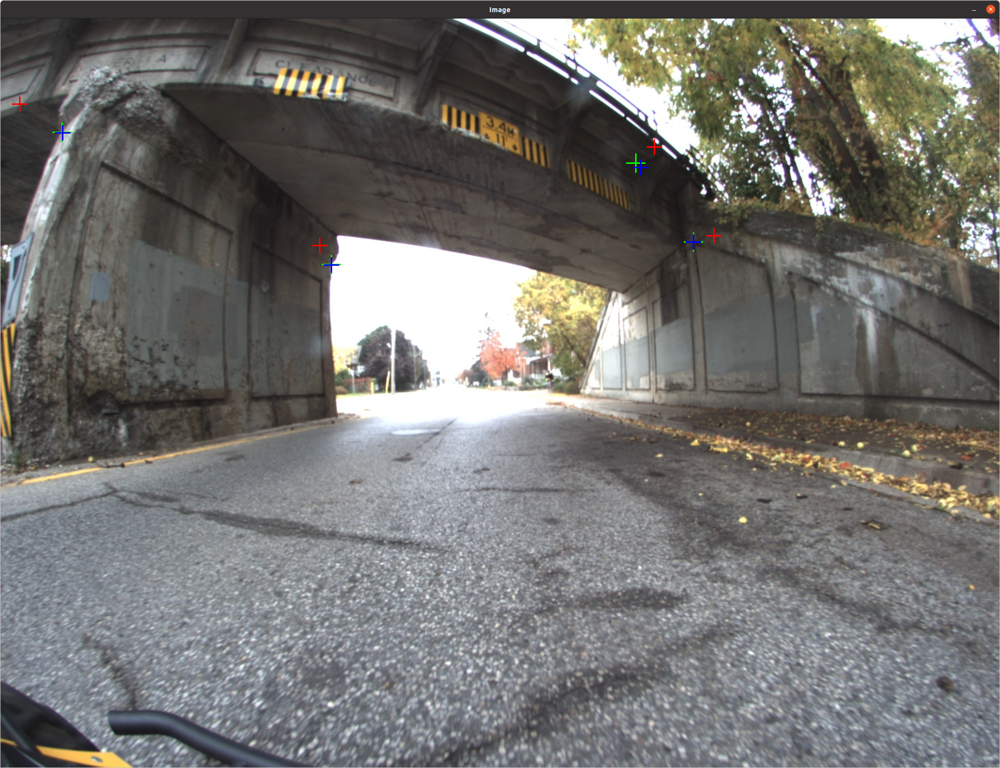

# camera_to_map_calibrator

**tl;dr**: A simple tool for calibration a prebuilt 3D map with associated trajectory, to an intrinsically calibrated camera that has taken images while traveling along that trajectory.

## Goal

The goal of this tool is to provide a more robust solution for calibrating cameras to lidars. Calibrating cameras to lidar is hard for many reasons such as: sparse sensing of lidar (e.g., Velodyne VLP-16), hard to find correspondences between camera-lidar data, small overlap between sensors, etc. There are a few repos out there that attempt to solve this problem (e.g., [1](https://github.com/nickcharron/vicon_calibration), [2](https://github.com/ankitdhall/lidar_camera_calibration), [3](https://github.com/OpenCalib/JointCalib), [4](https://github.com/beltransen/velo2cam_calibration), [5](https://github.com/SubMishMar/cam_lidar_calib)), but there are a few issues with this:

1. These repos are not always well supported or robust
2. They often support a small subset of 3D ranging devices
3. They require you to build a specific calibration target
4. If the extrinsics of your sensors change between when you calibrated and when you collected data, that data is now obsolete

The goal of this repo is to produce a more robust calibration procedure that can be performed on any dataset, regardless of the number or type of camera or 3D ranging device. Instead, we rely on generating a dense 3D map from the ranging data, and then human annotation to select matching features.

**Caviats**: 

1. This requires having a way to build a 3D map from the depth data. There are an abundance of open-source lidar-slam or rgbd-slam resources out there. This tool assumes if you need to calibrate a camera to a lidar, then you already have a way to generate a 3D map
2. Accuracy is not guaranteed: since there will be errors from SLAM and from the human annotation part, this may be less accurate than a target based calibration procedure. This tools focuses on robustness, and being able to generate a calibration on any dataset where the device is in motion and can generate a map.

This may be your ONLY tool to calibrate and save data if you didn't end up getting a good enough calibration for a particular dataset and are noticing after your extrinsics have changed (this was actually what happened to me which motivated this tool)


## Dependencies

This repo only depends on our internal [libbeam](https://github.com/BEAMRobotics/libbeam) library. 

Libeam depends on the following:

* [ROS](https://www.ros.org/)
* [Catch2](https://github.com/catchorg/Catch2)
* [Eigen3](https://gitlab.com/libeigen/eigen/)
* [PCL 1.11.1 or greater](https://github.com/PointCloudLibrary/pcl)
* [gflags](https://github.com/gflags/gflags)
* [nlohmann json](https://github.com/nlohmann/json)

For more information on libbeam and it's dependencies, see the [docs](https://github.com/BEAMRobotics/libbeam). 

## Install

First, install the libbeam dependencies. We have a [script](https://github.com/BEAMRobotics/libbeam/blob/master/scripts/install.bash) to help make this easier which you can run, or just copy commands from.

We recommend using catkin to build this tool and libbeam.

```
mkdir -p ~/cam2mapcalib_catkin_ws/src
cd ~/cam2mapcalib_catkin_ws
catkin build
```

Clone libbeam and this repo:

```
cd ~/cam2mapcalib_catkin_ws/src
git clone --depth 1 https://github.com/BEAMRobotics/libbeam.git
git clone --depth 1 https://github.com/nickcharron/camera_to_map_calibrator.git
```

Build:

```
cd ~/cam2mapcalib_catkin_ws/
catkin build -j2
```

## Running the tool

For information on required inputs to the binary and their formats, run the binary with -help flag:

```
cd ~/cam2mapcalib_catkin_ws/
./build/camera_to_map_calibrator/camera_to_map_calibrator_main -help
```

Note on data formats: see the tutorial below for an [example of the data format](https://drive.google.com/drive/folders/16HAdIEgmTeuaqhxy-c5pXVOWtOvlr_at?usp=sharing). For the images formats, this may seem like an odd image format, however, the goal is to conform to the format output by the [beam_robotics](https://github.com/BEAMRobotics/beam_robotics) [image extractor](https://github.com/BEAMRobotics/beam_robotics/blob/master/inspection_tools/inspection/src/ExtractImages.cpp). You may simplify your formats to only include the necessary data as described in the ImageContainer.h file. You may also run our image extractor if that makes your life easier, there are some useful tools with that binary.

Once you have all your required inputs in the correct format, run the binary using the same command as above.

First step will be to select matching features. The image below shows an example. For each image, you must select one map feature per camera feature, and they must be selected in the same order so that the optimizer knows the correspondences


Next, the tool will optimize and output results. It will then show you the results. An example of the results is shown below, where the coloring is as follows:

1. Red markers: map features projected into image using original calibration
2. Blue: hand labels of where those map features should project
3. Green: map features projected into image using optimized caibration

In other words, you want green and blue to overlap



